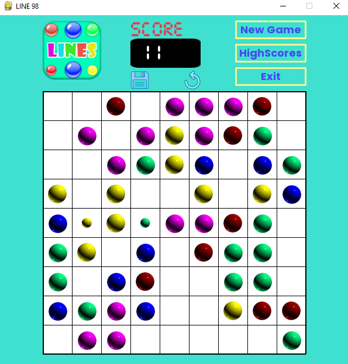
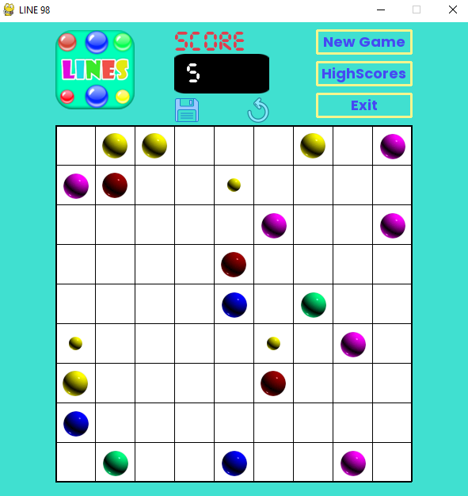
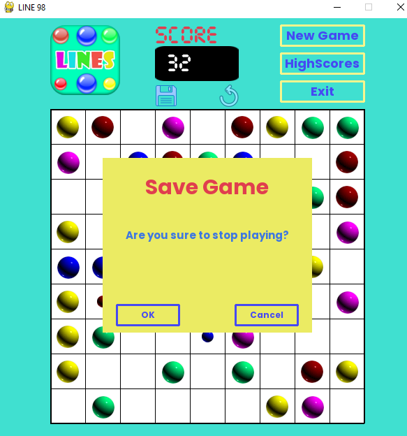
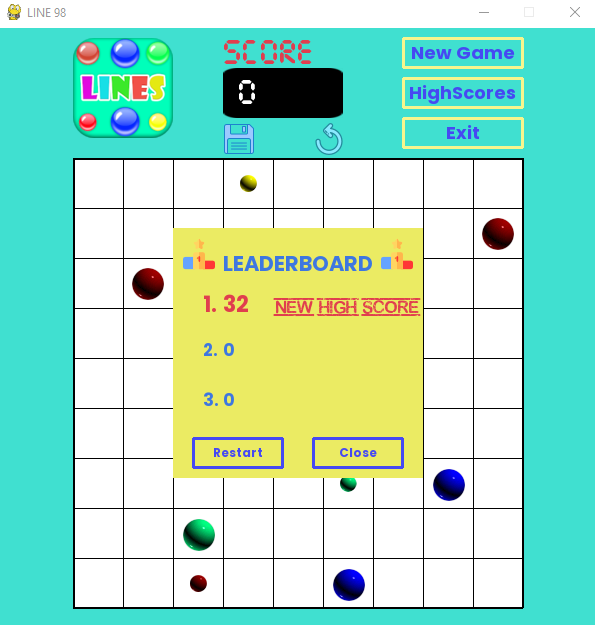

<div id="top"></div>


<!-- PROJECT LOGO -->
<br />
<div align="center">
  <a href="https://github.com/NgoQuocBao1010/Python---Line98-Game">
    
  </a>

  <h3 align="center"> <strong>LINE 98 Game</strong> </h3>

</p>
</div>


<!-- ABOUT THE PROJECT -->
## About The Project

LINE 98 game was a project from a course in my university. This is a fully functional game with all of the required features.

<p align="center"></p>
<p align="center"></p>
<p align="center"></p>
<p align="center"></p>

Apart from the main gameplay, here are some additional features that I built:
* Undo a move.
* Highscore saving.
* Save the score and exit while playing.

<p align="right">(<a href="#top">back to top</a>)</p>


### Built With
* [Python](https://python.org/)
* [Pygame](https://pygame.org/)

<p align="right">(<a href="#top">back to top</a>)</p>


<!-- GETTING STARTED -->
## Getting Started

This project is very simple to get started. Python and Pygame is the only requirements. Follow the below steps for the installation.

### Installation

1. Clone the repo
   ```sh
   git clone https://github.com/NgoQuocBao1010/Python---Line98-Game.git
   ```
2. Install required package
   ```sh
   pip install requirements.txt
   ```
3. Run the game:
    ```sh
   python main.py
   ```

<!-- USAGE EXAMPLES -->
_For more detail of usage and description, please refer to my [university report](docs/NLCS-B1809677.pdf) on the project_

<p align="right">(<a href="#top">back to top</a>)</p>

<!-- CONTRIBUTING -->
## Contributing

Contributions are what make the open source community such an amazing place to learn, inspire, and create. Any contributions you make are **greatly appreciated**.

If you have a suggestion that would make this better, please fork the repo and create a pull request.
Don't forget to give the project a star ⭐⭐⭐! Thanks again!

1. Fork the Project
2. Create your Feature Branch (`git checkout -b feature/AmazingFeature`)
3. Commit your Changes (`git commit -m 'Add some AmazingFeature'`)
4. Push to the Branch (`git push origin feature/AmazingFeature`)
5. Open a Pull Request

<p align="right">(<a href="#top">back to top</a>)</p>


<!-- LICENSE -->
## License

Distributed under the MIT License.

<p align="right">(<a href="#top">back to top</a>)</p>


<!-- CONTACT -->
## Contact me

Ngô Hồng Quốc Bảo - [@NgoQuocBao](https://twitter.com/ngohquocbao1010)

<p align="right">(<a href="#top">back to top</a>)</p>


<!-- ACKNOWLEDGMENTS -->
## Acknowledgments
This awesome README temaplate is from [Best README Template](https://github.com/othneildrew/Best-README-Template). ♥

<p align="right">(<a href="#top">back to top</a>)</p>
